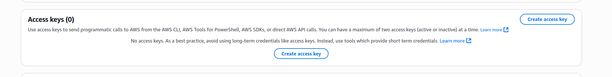
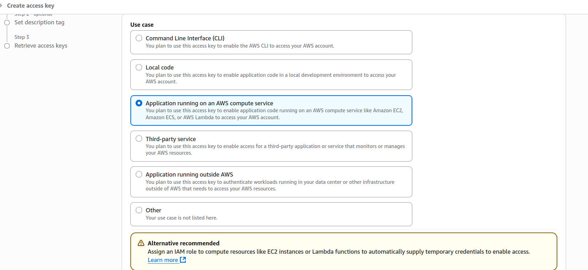
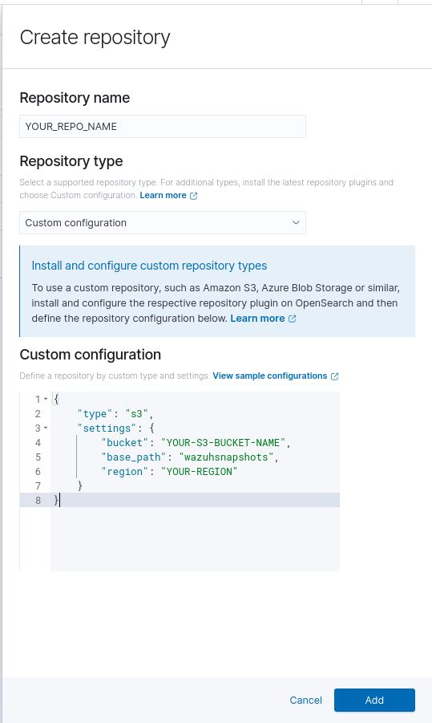
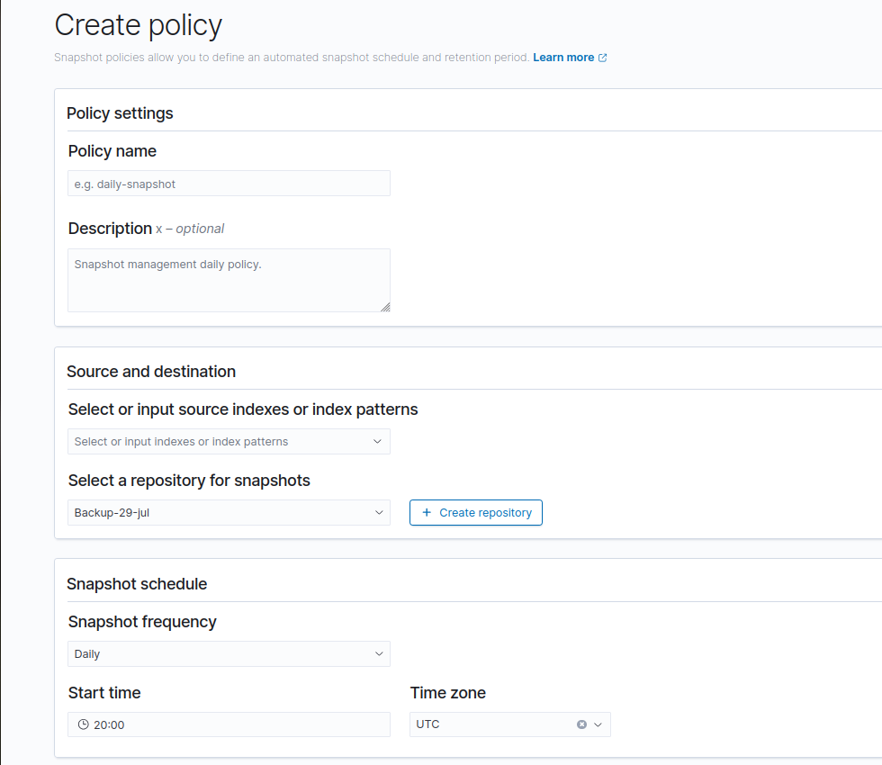

# Wazuh Kubernetes

[](https://wazuh.com/community/join-us-on-slack/)
[](https://groups.google.com/forum/#!forum/wazuh)
[](https://documentation.wazuh.com)
[](https://wazuh.com)

Deploy a Wazuh cluster with a basic indexer and dashboard stack on Kubernetes.

## Index

- [Wazuh Kubernetes](#wazuh-kubernetes)
  - [Branches](#branches)
  - [Documentation](#documentation)
  - [Things you need to configure on this repo before deploying it](#things-you-need-to-configure-on-this-repo-before-deploying-it)
    - [1) See the domain, SSL cert config (omit step 4 for now)](#1-see-the-domain-ssl-cert-config-here-omit-step-4-for-now)
    - [2) Create the private certs (dashboard_http and indexer_cluster)](#2-create-the-private-certs-stored-on-..wazuh-kuberneteswazuhcerts-for-both-dashboard_http-and-indexer_cluster)
    - [3) Configure integrations in master.conf and worker.conf (warning)](#3-configure-all-the-integrations-youll-use-on-the-masterconf-and-workerconf-warning)
    - [4) Apply the YAMLs using kustomization](#4-apply-the-yamls-files-using-the-kustomization)
    - [5) Configure pre-hooks](#5-configure-pre-hooks)
  - [Adjust wazuh resources](#adjust-wazuh-resources)
    - [1) Wazuh indexer](#1-wazuh-indexer)
    - [2) Wazuh manager (master / worker)](#2-wazuh-manager)
    - [3) Wazuh dashboard](#3-wazuh-dashboard)
    - [4) Secrets (SOPS)](#4-secrets)
      - [Decrypt the secrets](#1-decrypt-the-secrets)
      - [Edit a secret (re-encrypt)](#2-edit-a-secret)
      - [SOPS creation rules (.sops.yaml)](#3-sops-creations-rules)
      - [Maintaining the scripts](#4-maintaining-the-scripts)
  - [Amazon EKS development](#amazon-eks-development)
  - [Local development](#local-development)
  - [Directory structure](#directory-structure)
  - [How to safely update wazuh](#how-to-safely-update-wazuh)
    - [1. Scale down the indexer and manager pods](#1-scale-down-the-indexer-and-manager-pods)
    - [2. Delete the originals PVC's](#2-delete-the-originals-pvcs)
    - [3. Patch the original PV's](#3-patch-the-original-pvs)
    - [4. Scale up manager and indexer StatefulSet](#3-scale-up-manager-and-indexer-statefull-set)
    - [5. Patch the PV's back to wazuh-storage](#4-we-need-to-patch-again-the-pvs-to-the-original-storageclass)
    - [6. Restore the PV's and PVC's](#5-restore-the-pvs-and-pvcs)
  - [Wazuh Indexer S3 Snapshots Configuration](#wazuh-indexer-s3-snapshots-configuration)
    - [1. Create the S3 bucket](#1-create-the-s3-bucket)
    - [2. Create IAM Policy for S3 Snapshots](#2-create-iam-policy-for-s3-snapshots)
    - [3. Create IAM User with Programmatic Access](#3-create-iam-user-with-programmatic-access)
    - [Install repository-s3 plugin and set AWS keys](#1-install-the-repository-s3-plugin-on-indexer-pods-and-set-the-aws_acces_key_id-and-aws_secret_acces_key_id)
    - [Check everything is properly configured](#check-everything-its-properly-configured)
      - [Connect to wazuh indexer](#1-connect-to-wazuh-indexer)
      - [Verify keys mounted](#2-check-if-the-keys-are-properly-mounted)
      - [Create snapshot repository](#3-go-to-wazuh---gt--index-management---gt--repositories-and-click-on-create-repositorie)
      - [Create snapshot policy](#4-create-the-snapshot-policy)
      - [Restoring a snapshot](#5-restoring-a-snapshot)
    - [Wazuh Notifications](#wazuh-notifications)
    - [1) Create a notification channel](#1-create-a-notification-channel)
    - [2) Enable notifications for snapshot policies](#2-enable-notifications-for-snapshot-policies)
  - [Wazuh and n8n integration](#wazuh-and-n8n-integration)
  - [Wazuh Alert Deletion](#wazuh-alert-deletion)
    - [1) Create a State Management Policy](#1-create-a-state-management-policy)
    - [2) Configure ISM templates](#2-configure-ism-templates)
    - [3) Create states and transitions](#3-create-states-and-transitions)
    - [4) Finalize policy](#4-finalize-policy)
    - [5) Apply policy to existing indexes](#5-apply-policy-to-existing-indexes)
  - [Configuring a domain and SSL cert for wazuh dashboard](#configuring-a-domain-and-ssl-cert-and-for-wazuh-dashboard)
    - [1) Configure and set a domain on Route53](#1-configure-and-set-a-domain-on-route53)
    - [2) Install the external-dns plugin](#2-install-the-dns-external-plugin)
    - [3) Create the SSL cert (ACM)](#3-create-the-ssl-cert)
    - [4) Create the ingress object](#4-create-the-ingress-object)
  - [Health checks](#health-checks)
    - [Syslog health check](#syslog-health-check)
      - [1) Install required applications](#1-install-required-applications)
      - [2) Create IAM Policy and Role](#2-create-iam-policy-and-role)
      - [3) Attach role and configure aws-auth configmap](#3-attach-role-and-configure-aws-auth-configmap)
      - [4) Create rule and decoder needed](#4-create-rule-and-decoder-needed)
      - [5) Verify wazuh manager services (NodePort)](#5-verify-wazuh-manager-services)
      - [6) Create the script and add variables](#6-create-the-script-and-add-his-variables)
      - [7) Configure the CronJob](#7-configure-the-cronjob)
      - [8) How it works (syslog health check flow)](#8-how-it-works)
    - [Managers health checks](#managers)
      - [Obtain required secrets](#1-obtain-required-secrets)
      - [How it works (managers)](#2-how-it-works)
    - [Indexer health checks](#indexer)
      - [Obtain required secrets](#1-obtain-required-secrets-1)
      - [How it works (indexer)](#2-how-it-works-1)
  - [Contribute](#contribute)
  - [Credits and Thank you](#credits-and-thank-you)
  - [License and copyright](#license-and-copyright)
  - [References](#references)

Notes:
- Click any item to jump to that section in this document.
- If a link does not work as expected, use your editor/viewer’s in-page search for the exact heading text.


## Branches

* `master` branch contains the latest code, be aware of possible bugs on this branch.
* `stable` branch on correspond to the last Wazuh stable version.


## Documentation

## Things you need to configure on this repo before deploying it 

#### 1) See the domain, SSL cert config [here](#configuring-a-domain-and-ssl-cert-and-for-wazuh-dashboard) (ommit step 4 for now)  

#### 2) Create the privates certs stored on ../wazuh-kubernetes/wazuh/certs/ for both dashboard_http and indexer_cluster  
go within those two folders and run `./generate_certs.sh`  

#### 3) Configure all the integrations you'll use on the master.conf and worker.conf  
`WARNING`: the two files will have the same config, but do not copy the whole document content of one within the other, they have speciall sections for each one, if you do this you'll break wazuh.
#### 4) Apply the yaml's files using the kustomization   
Check you're on the correct path:  
```bash
$ pwd /your-folders-path/kubernetes/wazuh-kubernetes

```
Then apply the yaml's: 
```bash
kubectl apply -k envs/eks/
```
#### 5) Configure pre-hooks
To keep the repository secrets versioned and synchronized between your local machine and GitHub, we use a pre-commit hook. The hook executes the script at `/wazuh-kubernetes/sops-scripts/verify-secrets-dif.sh`

You can find the hook at .wazuh-git-hooks/pre-commit/secrets-verify. Install it with:

```bash
# Copy the versioned hook into the local git hooks directory
cp .wazuh-git-hooks/pre-commit/secrets-verify .git/hooks/pre-commit

# Make it executable
chmod +x .git/hooks/pre-commit

# Verify installation
ls -l .git/hooks/pre-commit
```

The hook runs the verification script before each commit. The script requires AWS credentials, so ensure they are configured in your environment.

## Adjust wazuh resources  

If you want to change the default values for the wazuh resources, you can do it from these files:  

### 1) Wazuh indexer:  

```
wazuh-kubernetes/envs/eks/indexer-resources.yaml
wazuh-kubernetes/wazuh/indexer_stack/wazuh-indexer/cluster/indexer-sts.yaml
``` 
make sure these file have the exact same config for the requested resources.  

### 2) Wazuh manager:  

```
master:
wazuh-kubernetes/envs/eks/wazuh-master-resources.yaml
wazuh-kubernetes/wazuh/wazuh_managers/wazuh-master-sts.yaml


worker:
wazuh-kubernetes/envs/eks/wazuh-worker-resources.yaml
wazuh-kubernetes/wazuh/wazuh_managers/wazuh-worker-sts.yaml
```  
make sure these file have the exact same config for the requested resources.    

### 3) Wazuh dashboard: 

```
wazuh-kubernetes/envs/eks/dashboard-resources.yaml
wazuh-kubernetes/wazuh/indexer_stack/wazuh-dashboard/dashboard-deploy.yaml

```  
make sure these file have the exact same config for the requested resources.  


### 4) Secrets 
As mentioned on [Things you need to configure on this repo before deploying it](#things-you-need-to-configure-on-this-repo-before-deploying-it)  in step 5, we use SOPS to encrypt secrets so they can be stored in GitHub.  
Install SOPS (stable release) from **https://github.com/getsops/sops**. You will also need access to the KMS key named `KMS-K8s-secrets-sops` (ask and admin for it) to encrypt/decrypt secrets.

#### 1) Decrypt the secrets
The repository includes helper scripts in wazuh/sops-scripts/ for encrypting, decrypting, and verifying secrets (used to keep secrets and scripts synchronized between local files and GitHub). To decrypt all secrets, run the decryption script:

```bash
./wazuh/sops-scripts/sops-decrypt-secrets.sh
```

The script produces files suffixed with `_decrypted` (for example `secret_name_decrypted`). Rename each file to remove the `_decrypted` suffix so the filenames match the entries in the kustomization files.

#### 2) Edit a secret
If you modify a secret, re-encrypt it before committing. The repository provides a pre-commit hook that runs `verify-secrets-dif.sh` to ensure secrets in the repo remain synchronized. If the verification fails, the commit will be blocked until the issue is resolved.  

**Important**: If you modified a secret, encrypt it manually using:  
```bash
#If its a yaml file
sops --encrypt --kms <arn_kms_key_here> file.yaml > file.enc.yaml

#If its a .conf file
sops --encrypt --kms <arn_kms_key_here> file.conf > file.enc

```

Avoid using the `sops-create-secrets.sh just to modify one secret, otherwise you'll create the secrets again with the same content, but git will detect them as a different files, and you'll add noise to the github repo.

---

## **IMPORTANT:**
 if you update the credentials of a secret, make sure to also update them on **`AWS Parameters Store too`**.


#### 3) SOPS creations rules
We use the `.sops.yaml` file for mantaining proper format on the files, make sure that file exists. 

#### 4) Maintaining the scripts
If you add secrets in new folders, update the corresponding sops-scripts to include those folders so encryption/decryption and verification remain correct and consistent.
## Amazon EKS development

To deploy a cluster on Amazon EKS cluster read the instructions on [instructions.md](instructions.md).
Note: For Kubernetes version 1.23 or higher, the assignment of an IAM Role is necessary for the CSI driver to function correctly. Within the AWS documentation you can find the instructions for the assignment: https://docs.aws.amazon.com/eks/latest/userguide/ebs-csi.html
The installation of the CSI driver is mandatory for new and old deployments if you are going to use Kubernetes 1.23 for the first time or you need to upgrade the cluster.

## Local development

To deploy a cluster on your local environment (like Minikube, Kind or Microk8s) read the instructions on [local-environment.md](local-environment.md).

## Directory structure

    ├── CHANGELOG.md
    ├── cleanup.md
    ├── envs
    │   ├── eks
    │   │   ├── dashboard-resources.yaml
    │   │   ├── indexer-resources.yaml
    │   │   ├── kustomization.yml
    │   │   ├── storage-class.yaml
    │   │   ├── wazuh-master-resources.yaml
    │   │   └── wazuh-worker-resources.yaml
    │   └── local-env
    │       ├── indexer-resources.yaml
    │       ├── kustomization.yml
    │       ├── storage-class.yaml
    │       └── wazuh-resources.yaml
    |
    ├── images
    ├── instructions.md
    ├── LICENSE
    ├── local-environment.md
    ├── README.md
    ├── upgrade.md
    ├── VERSION
    └── wazuh
        ├── base
        │   ├── storage-class.yaml
        │   └── wazuh-ns.yaml
        ├── certs
        │   ├── dashboard_http
        │   │   └── generate_certs.sh
        │   └── indexer_cluster
        │       └── generate_certs.sh
        ├── cron_job
        │   ├── secrets
        |   |       ├── googlechat-webhook.yaml (and encrypted version)
        │   │       └── wazuh-api-credentials.yaml  (and encrypted version)
        │   ├── indexer-healthcheck-cronjob.yaml  
        │   ├── manager-dashboard-healthcheck-cronjob.yaml                     
        │   └── syslog-healtcheck-cronjob.sh        
        ├── indexer_stack
        │   ├── wazuh-dashboard
        │   │   ├── dashboard_conf
        │   │   │   └── opensearch_dashboards.yml
        │   │   ├── dashboard-deploy.yaml
        |   |   ├── dashboard-ingress.yaml
        │   │   └── dashboard-svc.yaml
        │   └── wazuh-indexer
        │       ├── cluster
        │       │   ├── indexer-api-svc.yaml
        │       │   └── indexer-sts.yaml
        │       ├── indexer_conf
        │       │   ├── internal_users.yml
        |       |   ├── snapshot_storage.yaml
        │       │   └── opensearch.yml
        │       └── indexer-svc.yaml
        ├── kustomization.yml
        ├── secrets
        │   ├── dashboard-cred-secret.yaml (and encrypted version)
        │   ├── indexer-cred-secret.yaml (and encrypted version)
        │   ├── m365-cred-secret.yaml (and encrypted version)
        │   ├── wazuh-api-cred-secret.yaml (and encrypted version)
        │   ├── wazuh-authd-pass-secret.yaml (and encrypted version)
        │   ├── wazuh-cluster-key-secret.yaml (and encrypted version)
        │   └── wazuh-s3-creds.yaml (and encrypted version)
        ├── sops-scripts
        │   ├── sops-create-secrets.sh
        │   ├── sops-decrypt-secrets.sh
        │   └── verify-secrets-dif.sh
        ├── wazuh_managers
        |    ├── wazuh_conf
        |    |   └── syslog-ng-secrets
        |    |   |   ├── ca.yaml (and encrypted version)
        |    │   |   ├── tlscrt.yaml (and encrypted version)
        |    │   |   └── tlskey.yaml (and encrypted version)                          
        |    │   ├── entrypoint-integrations-cm.yaml
        |    |   ├── entrypoint-syslog-cm.yaml
        |    |   ├── filebeat.yml
        |    |   ├── local_rules_configmap.yaml
        |    |   ├── master.conf
        |    |   ├── misp-rules-configmap.yaml
        |    |   ├── sentinelone-rules-configmap.yaml
        |    |   ├── sentinelone-rules-configmap.yaml
        |    |   ├── syslog-ng-cm.yaml
        |    |   ├── wazuh-template-json-configmap.yaml
        |    │   └── worker.conf
        |    └── wazuh-integrations
        |    |   ├── custom-iris-configmap.yaml
        |    |   ├── custom-misp-configmap.yaml   
        |    |   ├── n8n-cm.yaml
        |    |   ├── n8n-py-cm.yaml                   
        |    |   └── misp-script.py
        |    ├── syslog-svc.yaml             
        |    ├── wazuh-cluster-svc.yaml        
        |    ├── wazuh-master-sts.yaml
        |    ├── wazuh-master-svc.yaml
        |    ├── wazuh-workers-svc.yaml
        |    └── wazuh-worker-sts.yaml
        └───kustomization.yml   

  
## How to safely update wazuh
---
## IMPORTANT:
  If these steps break Wazuh, you can delete the old PVCs and create new ones. You will need to reconfigure the S3 snapshot bucket and snapshot deletion policy, and recreate any users and roles.

---  
Once said that, we can start.  
Before updating Wazuh, make sure to create a snapshot of your indexes. You can follow the steps in the [Wazuh Indexer S3 Snapshots Configuration](#wazuh-indexer-s3-snapshots-configuration) section.

Once your snapshot is created, you should provision new PVCs without deleting the existing ones. This approach is recommended because updating Wazuh may also upgrade OpenSearch. If the new Wazuh version fails and you need to revert, OpenSearch will not automatically downgrade, and you cannot change its version via YAML files since it is managed by the Wazuh indexer. This situation can be problematic.

By updating Wazuh with fresh PVCs, you ensure that if something goes wrong, you can restore the previous version using the original PVCs, which contain the compatible OpenSearch data. With this in mind, let's proceed with the update steps.

### 1. Scale down the indexer and manager pods  

```
kubectl scale statefulset wazuh-indexer -n wazuh --replicas=0
kubectl scale statefulset wazuh-manager-master -n wazuh --replicas=0
kubectl scale statefulset wazuh-manager-worker -n wazuh --replicas=0
``` 
wait a few seconds until the pods are deleted, you can check if they already has been deleted with `kubectl get pods -n wazuh` you should see only the dashboard pod.  

### 2. Delete the originals PVC's
Delete the PVC's for the indexer and master, you can look the names using: 
```bash
$ kubectl get pvc -n wazuh
NAME                                          STATUS   VOLUME                                     CAPACITY   ACCESS MODES   STORAGECLASS    VOLUMEATTRIBUTESCLASS   AGE
snapshots-pvc                                 Bound    snapshots-pv                               50Gi       RWX                            <unset>                 53d
wazuh-indexer-wazuh-indexer-0                 Bound    pvc-95aa80a1-b4d4-47cc-bbb3-f865881e8de4   300Gi      RWO            wazuh-storage   <unset>                 40m
wazuh-indexer-wazuh-indexer-1                 Bound    pvc-ddeeaa68-8ef3-4b27-a324-63837badff29   300Gi      RWO            wazuh-storage   <unset>                 39m
wazuh-manager-master-wazuh-manager-master-0   Bound    pvc-f422dc1c-2401-4d7a-b02c-1eb269ee347b   50Gi       RWO            wazuh-storage   <unset>                 2d
wazuh-manager-worker-wazuh-manager-worker-0   Bound    pvc-79790861-2177-47d5-86c7-5da07792a5f5   50Gi       RWO            wazuh-storage   <unset>                 2d

```  
Then delete the ones asociated with the indexer and manager, you can do: 
```bash
kubectl delete pvc wazuh-indexer-wazuh-indexer-0 wazuh-indexer-wazuh-indexer-1 wazuh-manager-master-wazuh-manager-master-0 wazuh-manager-worker-wazuh-manager-worker-0 -n wazuh
```
once deleted, you can check again with `kubectl get pvc -n wazuh`, they should be gone, but don't worry, you didn't deleted the Persistance Volumes, just the Claims wazuh was using for those PV's.  

### 3. Patch the original PV's 
You need to change the storage class of the original PVs to allow Kubernetes to create new ones. If Kubernetes finds PVs that exactly match the requirements of the StatefulSets for the Wazuh indexer and manager, it will reuse the original PVs once they become Available. To prevent this and ensure new PVs are created, follow these steps:
```bash
$ kubectl get pv
NAME                                       CAPACITY   ACCESS MODES   RECLAIM POLICY   STATUS      CLAIM                                               STORAGECLASS    VOLUMEATTRIBUTESCLASS   REASON   AGE
pvc-10bf2193-7c60-42b6-a5fd-bf582ace15f3   5Gi        RWO            Delete           Bound       shuffle/backend-apps-claim                          shuffle-data    <unset>                          98d
pvc-14745f27-9470-4a3b-b097-87f186c24347   30Gi       RWO            Delete           Bound       iris-web/iris-worker-claim                          iris-sc         <unset>                          183d
pvc-3b819a85-d87c-46df-b764-89a06c020027   30Gi       RWO            Delete           Bound       iris-web/iris-app-claim                             iris-sc         <unset>                          183d
pvc-5191ab26-0566-4b4e-a78a-8e49755b2f7f   30Gi       RWO            Delete           Bound       shuffle/opensearch-claim0                           shuffle-data    <unset>                          98d
pvc-79790861-2177-47d5-86c7-5da07792a5f5   50Gi       RWO            Retain           Released    wazuh/wazuh-manager-worker-wazuh-manager-worker-0   wazuh-storage   <unset>                          302d
pvc-95aa80a1-b4d4-47cc-bbb3-f865881e8de4   300Gi      RWO            Retain           Released    wazuh/wazuh-indexer-wazuh-indexer-0                 wazuh-storage   <unset>                          47h
pvc-b8795ae3-bd41-4cf7-9e29-3020e95f2f76   30Gi       RWO            Delete           Bound       iris-web/iris-psql-claim                            iris-sc         <unset>                          171d
pvc-d900e964-9e82-4520-b5e8-4c18bb56d6c7   5Gi        RWO            Delete           Bound       shuffle/backend-files-claim                         shuffle-data    <unset>                          98d
pvc-ddeeaa68-8ef3-4b27-a324-63837badff29   300Gi      RWO            Retain           Released    wazuh/wazuh-indexer-wazuh-indexer-1                 wazuh-storage   <unset>                          47h
pvc-f422dc1c-2401-4d7a-b02c-1eb269ee347b   50Gi       RWO            Retain           Released    wazuh/wazuh-manager-master-wazuh-manager-master-0   wazuh-storage   <unset>                          302d
snapshots-pv                               50Gi       RWX            Retain           Bound       wazuh/snapshots-pvc                                                 <unset>                          65d
``` 
You'll easily identify the original PVs by their `STATUS`, which will be set to `Released`. These are the ones that need their `STORAGECLASS` changed from `wazuh-storage` to a different value, such as `manual-backup`. To do this, follow these steps:
```bash
 kubectl patch pv <INDEXER-0-PV-NAME> <INDEXER-0-PV-NAME> <MASTER-PV-NAME> <WORKER-PV-NAME> -p '{"spec":{"storageClassName":"manual-backup"}}'
```
once done, we can check again with `kubectl get pv` and now the `STORAGECLASS` should be `manual-backup`.  

### 3. Scale up manager and indexer Statefull set  

Now we can create the new PV's and PVC's, we just need to run the following commands:  
```bash
kubectl scale statefulset wazuh-indexer -n wazuh --replicas=2
kubectl scale statefulset wazuh-manager-master -n wazuh --replicas=1
kubectl scale statefulset wazuh-manager-worker -n wazuh --replicas=1
```
wait a few moments and check wazuh is up and running, once wazuh is running, you can update wazuh and see if it's working. If everything is okay, then you can connect the originals PV's again. If wazuh new version is broken, and you want to go back to the previous version, the following steps will be the same.  

### 4.  We need to patch again the PV's to the original StorageClass  

Run the same command you runned on step 2 but this time use the wazuh storage class name:  
```bash
 kubectl patch pv <INDEXER-0-PV-NAME> <INDEXER-0-PV-NAME> <MASTER-PV-NAME> <WORKER-PV-NAME> -p '{"spec":{"storageClassName":"wazuh-storage"}}'
```
Check the patch was applied properly:   
```bash
kubectl get pv
``` 
you should see now the originals PV's with the `STORAGECLASS` column on `wazuh-storage`
### 5. Restore the PV's and PVC's  
First we need to redo [step 1](#1-scale-down-the-indexer-and-manager-pods).  

Then we are going to delete the new PVC's  and PV's using: 
```bash
kubectl delete pvc wazuh/wazuh-indexer-wazuh-indexer-1 wazuh/wazuh-indexer-wazuh-indexer-0 wazuh/wazuh-manager-worker-wazuh-manager-worker-0 wazuh/wazuh-manager-worker-wazuh-manager-master-0 -n wazuh 

kubectl delete pv <new-pvs-names> 
``` 
Finally, we need to change the `STATUS` of the original PVs from `Released` to `Available`. This ensures that when we scale up the pods, Kubernetes will automatically use these PVs for the Wazuh indexer and manager, as they match the requirements specified in the StatefulSets. To do this, edit each PV as follows: 

```bash
kubectl edit pv <PV-NAME>
```
It'll look like this: 

```yaml
# Please edit the object below. Lines beginning with a '#' will be ignored,
# and an empty file will abort the edit. If an error occurs while saving this file will be
# reopened with the relevant failures.
#
apiVersion: v1
kind: PersistentVolume
metadata:
  annotations:
    pv.kubernetes.io/bound-by-controller: "yes"
    pv.kubernetes.io/migrated-to: ebs.csi.aws.com
    pv.kubernetes.io/provisioned-by: kubernetes.io/aws-ebs
    volume.kubernetes.io/provisioner-deletion-secret-name: ""
    volume.kubernetes.io/provisioner-deletion-secret-namespace: ""
  creationTimestamp: "2025-10-01T14:10:52Z"
  finalizers:
  - kubernetes.io/pv-protection
  - external-attacher/ebs-csi-aws-com
  labels:
    topology.kubernetes.io/region: us-east-1
    topology.kubernetes.io/zone: us-east-1a
  name: pvc-95aa80a1-b4d4-47cc-bbb3-f865881e8de4
  resourceVersion: "169626996"
  uid: fd73ac26-2711-4055-af93-3db4855ef815
spec:
  accessModes:
  - ReadWriteOnce
  awsElasticBlockStore:
    fsType: ext4
    volumeID: vol-0400063ec92e7bc74
  capacity:
    storage: 300Gi
  claimRef:                ####################################DELETE FROM THIS LINE#####
    apiVersion: v1
    kind: PersistentVolumeClaim
    name: wazuh-indexer-wazuh-indexer-0
    namespace: wazuh
    resourceVersion: "169626989"
    uid: b5e8edb7-263a-4c05-973d-aad0f01b5ae1 #################TILL HERE#################
  nodeAffinity:
    required:
      nodeSelectorTerms:
      - matchExpressions:
        - key: topology.kubernetes.io/zone
          operator: In
          values:
          - us-east-1a
        - key: topology.kubernetes.io/region
          operator: In
          values:
          - us-east-1
  persistentVolumeReclaimPolicy: Retain

``` 
we are going to delete the whole `claimRef:` section, as marked above with the comments for all the original PV's of Wazuh indexer and master. Once done, save the file and exit, now when you run a `kubectl get pv` you  
should see the original PV's `STATUS` = Avaibable.  

Now for finishing we scale up again: 

```bash
kubectl scale statefulset wazuh-indexer -n wazuh --replicas=2
kubectl scale statefulset wazuh-manager-master -n wazuh --replicas=1
kubectl scale statefulset wazuh-manager-worker -n wazuh --replicas=1
``` 

Wait a few minutes and check wazuh's working properly again and with the correct version, you can check the version connecting to the master pods and running:  
```bash
 /var/ossec/bin/wazuh-control info
``` 
Expected output: 
```bash
WAZUH_VERSION="v4.12.0"
WAZUH_REVISION="rc1"
WAZUH_TYPE="server"
```
## Wazuh Indexer S3 Snapshots Configuration

This section documents the configuration steps required to enable Wazuh Indexer (based on OpenSearch) to create and store snapshots in an AWS S3 bucket.

### 1. Create the S3 bucket
Create a bucket on AWS without any special config, just the defaults

### 2. Create IAM Policy for S3 Snapshots

In AWS IAM, create a new policy (e.g., `Wazuh-S3-Snapshot-Policy`) with the following JSON content (replace the bucket name with the one created on the 1st step):

```json
{
    "Version": "2012-10-17",
    "Statement": [
        {
            "Effect": "Allow",
            "Action": [
                "s3:GetBucketLocation",
                "s3:ListBucket",
                "s3:ListBucketMultipartUploads",
                "s3:ListBucketVersions"
            ],
            "Resource": [
                "arn:aws:s3:::<REPLACE-WITH-YOUR-S3-BUCKET-NAME>"
            ]
        },
        {
            "Effect": "Allow",
            "Action": [
                "s3:AbortMultipartUpload",
                "s3:DeleteObject",
                "s3:GetObject",
                "s3:ListMultipartUploadParts",
                "s3:PutObject"
            ],
            "Resource": [
                "arn:aws:s3:::<REPLACE-WITH-YOUR-S3-BUCKET-NAME>/*"
            ]
        }
    ]
}
```    
### 3. Create IAM User with Programmatic Access 
#### a) Go to IAM on AWS and click on users -> ceate a new user   
  
select a name and `DO NOT` select the "Provide user access to...", then hit next  

#### b) Select the permissions options 'Attach policies directly' 
 
here you're gonna type your policy name created on the [step 2](#2-create-iam-policy-for-s3-snapshots) 

#### c) Review the details of the users, and if everything it is okay, hit create, then go to the user and click on 'Security Credentials' scroll down til you find access key section, hit create access key
 

select the option `Application running on an AWS compute service`  

  
then hit create, and copy those credentials, you'll need them on the next step. 

### 1. Install the `repository-s3` plugin on indexer pods and set the `AWS_ACCES_KEY_ID` and `AWS_SECRET_ACCES_KEY_ID`
We do the configurations using the `command` of the indexer container (`indexer-sts.yaml`):

```yaml
            #Add the following envs
            - name: OPENSEARCH_PATH_CONF  # Config for S3 bucket snapshots
              value: "/usr/share/wazuh-indexer"     
            - name: AWS_ACCESS_KEY_ID
              valueFrom:
                secretKeyRef:
                  name: wazuh-s3-creds
                  key: access_key_id
            - name: AWS_SECRET_ACCESS_KEY
              valueFrom:
                secretKeyRef:
                  name: wazuh-s3-creds
                  key: secret_access_key    


```

```yaml
          command:  #Install the S3 plugin if not installed yet, then start normally
            - sh
            - -c
            - |
            # 

            # The following checks if the repository-s3 plugin is not installed before proceeding     
              if ! /usr/share/wazuh-indexer/bin/opensearch-plugin list | grep -q repository-s3; then
                echo "Installing repository-s3 plugin..."
                echo "y" | /usr/share/wazuh-indexer/bin/opensearch-plugin install repository-s3
              fi

              # Create keystore if not exist
              if [ ! -f /usr/share/wazuh-indexer/opensearch.keystore ] || ! /usr/share/wazuh-indexer/bin/opensearch-keystore list > /dev/null 2>&1; then
                  echo "Creating OpenSearch keystore..."
                  /usr/share/wazuh-indexer/bin/opensearch-keystore create
              fi              

              if ! /usr/share/wazuh-indexer/bin/opensearch-keystore list | grep -q s3.client.default.access_key; then
                echo -n "$AWS_ACCESS_KEY_ID" | /usr/share/wazuh-indexer/bin/opensearch-keystore add s3.client.default.access_key --stdin
              fi
              if ! /usr/share/wazuh-indexer/bin/opensearch-keystore list | grep -q s3.client.default.secret_key; then
                echo -n "$AWS_SECRET_ACCESS_KEY" | /usr/share/wazuh-indexer/bin/opensearch-keystore add s3.client.default.secret_key --stdin
              fi   
            
              # Set correct perms and owner
              chown wazuh-indexer:wazuh-indexer /usr/share/wazuh-indexer/opensearch.keystore
              chmod 660 /usr/share/wazuh-indexer/opensearch.keystore


              # Start original entrypoint
              exec /usr/share/wazuh-indexer/bin/systemd-entrypoint     
          #Rest of the code bellow             
          ports:
            - containerPort: 9200
              name: indexer-rest
            - containerPort: 9300
              name: indexer-nodes
```
### Check everything it's  properly configured

#### 1) Connect to wazuh indexer :  

`kubectl exec -it wazuh-indexer-0 -n wazuh -- /bin/bash`  

#### 2) Check if the keys are properly mounted:  
```bash 
bash-5.2$ /usr/share/wazuh-indexer/bin/opensearch-keystore list
keystore.seed
s3.client.default.access_key
s3.client.default.secret_key
bash-5.2$ 


#Check the s3 plugin is installed: 
bash-5.2$ /usr/share/wazuh-indexer/bin/opensearch-plugin list  
opensearch-alerting
opensearch-anomaly-detection
opensearch-asynchronous-search
opensearch-cross-cluster-replication
opensearch-geospatial
opensearch-index-management
opensearch-job-scheduler
opensearch-knn
opensearch-ml
opensearch-neural-search
opensearch-notifications
opensearch-notifications-core
opensearch-observability
opensearch-performance-analyzer
opensearch-reports-scheduler
opensearch-security
opensearch-sql
repository-s3  #HERE YOU SHOULD SEE THE S3 PLUGIN

```
you can't see the content of the keys, but you can try creating a snapshot repositorie, if you can create it then the keys are OK.  

#### 3) Go to Wazuh - > Index Management -> Repositories and click on 'Create Repositorie'
  

you need to put a repo name, your s3 bucket name and region AWS region (e.g us-east-1). Here's the code: 

```json
{
    "type": "s3",
    "settings": {
        "bucket": "<YOUR-S3-BUCKET-NAME>",
        "base_path": "wazuhsnapshots",
        "region": "<YOUR-AWS-REGION>"
    }
}
```
Note: `base_path` is a subdirectory within your S3 bucket, you can name it however you want.

#### 4) Create the Snapshot Policy 
In the same section (Index Managament) go to `Snapshots Policy` and click on create a new one  

   

 select a `Policy Name` and `Description`. `Source and destination` select the indexes you want to use for your snapshots (you have to type it), e.g:  
 ``` bash
 wazuh-alerts-4.x-*
 ```  

 the destination will be the repo you just created on the previous step, or if you want you can create the repo right there clicking on the `Create repository` buttom at the right.  
 Next set the snapshot frequency you need.  

 
next click on `Specify retention conditions` and select the time you want to have those snapshots on S3 before deleting them forever. Finally click on `Create`.  

#### 5) Restoring a snapshot  

Go to `Snapshots`, select your snapshots and click on `restore`, then you'll need to select if you want to restore all the indexes or just a set of them. You'll need to have an account with snapshots permissions for this step.  If you are having problems with the permissions, you can check the logs by trying to restore the snapshot from the terminal, like this:  
```bash
curl -k -u <user>:'<password>' -X POST \
  "https://indexer:9200/_snapshot/<snapshot_repository>/<snapshot_name>/_restore?master_timeout=5m" \
  -H 'Content-Type: application/json' \
  -d '{
        "indices": "<index_name>",
        "include_global_state": false
      }'
```  
make sure to replace `<snapshot_repository>, <snapshot_name>` and `<index_name>` with the proper values

---
## Wazuh and n8n integration


This integration enables sending Wazuh alerts to n8n, where a SOC Analyst AI agent can classify them as false positives or identify critical alerts that require reporting to clients.

### Configuration Files

You need to configure the following files:

```bash
- entrypoint-integrations-cm.yaml
- master.conf
- worker.conf
- n8n-cm.yaml
- n8n-py-cm.yaml
- wazuh-master-sts.yaml
- wazuh-worker-sts.yaml
```

### Setup Instructions

Create and mount the scripts `custom-n8n` and `custom-n8n.py` in the `/var/ossec/integrations` folder with permissions `750` and ownership `root:wazuh`. Use `entrypoint-integrations-cm.yaml` to mount them at `/wazuh-config-mount/integrations/`, where Wazuh automatically moves them to the integrations folder.

In `ossec.conf`, always use the `custom-<integration-name>` format. For example:

```html
  <!-- n8n integration -->
  <integration>
    <name>custom-n8n</name>
    <hook_url><HOOK_URL></hook_url>
    <level>8</level>
    <alert_format>json</alert_format>
  </integration>
```

### Implementation Notes

The scripts are based on the default Shuffle integration scripts provided by Wazuh, with modifications to work with n8n.


---
## Wazuh Notifications

To send and receive notifications for Wazuh events:

### 1) Create a notification channel

Go to **Explore → Notifications → Channels** and click **Create channel**.

Provide:
- Channel name
- Description
- Channel type (e.g., Slack, email, webhook)
- Relevant credentials (e.g., Slack webhook URL)

### 2) Enable notifications for snapshot policies

Go to **Index Management → Snapshot Management → Snapshot Policies**.

Select the policy you want to enable notifications for and modify the **Notifications** section to specify when notifications should be sent and which notification channel to use.

## Wazuh Alert Deletion

Alert deletion is managed through State Management Policies.

### 1) Create a State Management Policy

Go to **Index Management → State Management Policies** and click **Create policy**.

Provide:
- Policy ID
- Description
- Notification Channel (optional)

### 2) Configure ISM templates

Click **Add template** under **ISM templates** and enter an index pattern (e.g., `wazuh-alerts-*`) to apply this policy to future alert indices automatically.

### 3) Create states and transitions

Under **States**, click **Add state** to create an initial state (e.g., `initial`).

Click **Add state** again to create a deletion state (e.g., `delete_alerts`). Click **Add action** and select **Delete**.

Click **Add transition** and configure:
- **Destination state**: `delete_alerts`
- **Condition**: Minimum Index Age
- **Minimum Index Age**: e.g., `46d` for 46 days

### 4) Finalize policy

Set the **Initial State** to `initial` and click **Create**.

### 5) Apply policy to existing indexes

If indexes already exist, you must manually apply the policy:

1. Go to **Index Management → Indexes**
2. Select the indexes you want to manage
3. Click **Actions** dropdown and select **Apply policy**
4. Choose the policy and click **Apply**

The indexes will now appear under **Policy Managed Indexes**.

---
## Configuring a domain and SSL cert and for wazuh dashboard  
We are going to do it using route53, external plugin, an ALB and ingress.   

#### 1) Configure and set a domain on route53. 
For this you need to create a hosted zone, once done you need to set the external dns-plugin.  

#### 2) Install the dns external plugin 
Once done, you need to configure this section of the `external-dns-setup.yaml` (you can get this file on the repo [`external-dns-kubernetes`](https://github.com/Marvel-Advisors-LLC/external-dns-plugin))  

```yaml
      containers:
        - name: external-dns
          image: registry.k8s.io/external-dns/external-dns:v0.15.1
          args:
            - --source=service
            - --source=ingress
            - --domain-filter=<HOSTED-ZONE-YOU-CREATED> # will make ExternalDNS see only the hosted zones matching provided domain, omit to process all available hosted zones
            - --provider=aws
            - --policy=upsert-only # would prevent ExternalDNS from deleting any records, omit to enable full synchronization
            - --aws-zone-type=public # only look at public hosted zones (valid values are public, private or no value for both)
            - --registry=txt
            - --txt-owner-id=external-dns
            #- --log-level=debug
          env:
            - name: AWS_DEFAULT_REGION
              value: us-east-1 # change to region where EKS is installed
```
once done, apply the yaml and check everything is running properly.  

#### 3) Create the SSL cert.  
Go to AWS-> Certificate manager, and click on Request-> Request a public certificate.  
Use the following config:  
```yaml
- Fully qualified domain name: *.<HOSTED-ZONE-YOU-CREATED>  #This will apply the cert on each sub domain of your hosted zone
- Validation method: DNS validation - recommended 
```

Then click on request and validate the DNS using route53.   

#### 4) Create the ingress object  

Configure the file `wazuh-kubernetes/wazuh/indexer-stack/wazuh-dashboard/dashboard-ingress.yaml` with the domain name you  
 want (must be something like `my-domain.<HOSTED-ZONE-YOU-CREATED>`) and ssl cert arn.  
Then run: 
```bash
$ pwd 
/your-pc-path/kubernetes/wazuh-kubernetes
$ kubectl apply -k envs/eks/
```
If everything is okay, you should be able to connect via https to your wazuh dashboard on you new domain name.  

---
## Health checks

To ensure the most critical components of Wazuh are functioning — and to verify the syslog sources that send S1 and Palo Alto alerts from Rise Broadband — we run continuous health checks using CronJobs.

### Syslog health check

For syslog testing we use a t2.micro EC2 instance in us-east-1. This instance also acts as a Tailscale exit node and is in the same VPC as the EKS cluster, where Wazuh and the NLB for syslogs run. This setup avoids hairpinning issues when sending health checks from inside the cluster.

The steps to configure the machine and the CronJob are the following:

#### 1) Install required applications

On the EC2 instance, install:
  
```bash
   - Aws CLI
   - Kubectl 
   - Cronjob
```  

#### 2) Create IAM Policy and Role
Once you installed everything, you'll need to crate the following policy and role on AWS IAM:  

`EksDescribeClusterPolicy` :  

```json
{
    "Version": "2012-10-17",
    "Statement": [
        {
            "Effect": "Allow",
            "Action": [
                "eks:DescribeCluster",
                "sts:AssumeRole"
            ],
            "Resource": [
                "arn:aws:eks:us-east-1:590183765660:cluster/eks-cluster"
            ]
        }
    ]
}
```    
`EksKubectlAccessRole`:  
```bash
Permissions policies: AmazonSSMManagedInstanceCore, AmazonSSMPatchAssociation, EksDescribeClusterPolicy
```  
#### 3) Attach role and configure aws-auth configmap

After creating both, attach the role to the EC2 instance. The EksDescribeClusterPolicy is required to retrieve the cluster node IPs used to obtain the Wazuh manager API token. Once the role is attached, add it to the aws-auth ConfigMap for the EKS cluster. From a machine that has access to the cluster, run:

```bash
kubectl edit -n kube-system configmap/aws-auth
```

Once inside add the role like this: 
```bash
  GNU nano 6.2                                                                                                             /tmp/kubectl-edit-2812522102.yaml *                                                                                                                     
# Please edit the object below. Lines beginning with a '#' will be ignored,
# and an empty file will abort the edit. If an error occurs while saving this file will be
# reopened with the relevant failures.
#
apiVersion: v1
data:
  mapRoles: |
    - groups:
      - system:bootstrappers
      - system:nodes
      rolearn: arn:aws:iam::<ACCOUNT_ID>:role/node-role
      username: system:node:{{EC2PrivateDNSName}}
    - groups:
      - system:masters
      rolearn: arn:aws:iam::<ACCOUNT_ID>:role/admin-role
      username: admin
    - groups: # <---------------- Here you'll add this
      - system:masters
      rolearn: arn:aws:iam::<ACCOUNT_ID>:role/EksKubectlAccessRole
      username: ec2-cronjob-admin
  mapUsers: |
    []
kind: ConfigMap
metadata:
  creationTimestamp: "2024-07-04T11:21:29Z"
  name: aws-auth
  namespace: kube-system
  resourceVersion: "131518920"
  uid: fb1609ca-dc54-4ce2-bc5c-fc8260f57ceb


```  
Once that's done, add the required configuration on the EC2 instance so you can test connectivity to the EKS cluster using kubectl. From the EC2 instance, run the following command:

```bash
aws eks --region us-east-1 update-kubeconfig --name <CLUSTER-NAME>
```

#### 4) Create rule and decoder needed 
The cronjob script will send a test alert that ensures the conectivity, in order to do that we need to create that test rule and a decoder for it, so we created inside `../wazuh/wazuh_managers/wazuh_conf/sentinelone-decoders-configmap.yaml` this decoder:  
```html
    <decoder name="test-syslog">
        <prematch>testhost</prematch>
    </decoder>
```  
and inside `../wazuh/wazuh_managers/wazuh_conf/local_rules_configmap.yaml` this rule:  
```html
    <!-- TEST SYSLOG RULE -->
    <group name="test-syslog,">
      <rule id="100007" level="5">
        <decoded_as>test-syslog</decoded_as>
        <description>Test alert for syslog connectivity testing</description>
      </rule>
    </group>    

```  
make sure to has that rule and decoder, you can test if it works using the rule test of wazuh dashboard: Server Managment -> Ruleset Test.  
Try using this rule test:  
```bash
<134>1 2025-10-28T14:00:00Z testhost test-syslog - - - Your test message here
```
Output should be something like:   
```bash

**Messages:
	INFO: (7202): Session initialized with token '8e252976'

**Phase 1: Completed pre-decoding.
	full event: '<134>1 2025-10-28T14:00:00Z testhost test-syslog - - - Your test message here'

**Phase 2: Completed decoding.
	name: 'test-syslog'

**Phase 3: Completed filtering (rules).
	id: '100007'
	level: '5'
	description: 'Test alert for syslog connectivity testing'
	groups: '["test-syslog"]'
	firedtimes: '1'
	mail: 'true'
**Alert to be generated.
```
#### 5) Verify wazuh manager services

Make sure both `/wazuh/wazuh_managers/wazuh-master-svc.yaml` and `/wazuh/wazuh_managers/wazuh-worker-svc.yaml` are NodePort types, like this (in this example we use the `worker-svc`):  

```yaml
spec:
  type: NodePort  # <----This is the important line
  selector:
    app: wazuh-manager
    node-type: worker
```    

#### 6) Create the script and add his variables
Now we need some credentials and environment variables. First, get the NodePort of the Wazuh API service like this: 
```bash
$ kubectl get svc -n wazuh

output: 


NAME               TYPE           CLUSTER-IP       EXTERNAL-IP                                                         PORT(S)                                        AGE
dashboard          ClusterIP      172.xx.xxx.x     <none>                                                              80/TCP                                         94d
indexer            ClusterIP      172.xx.xxx.xxx   <none>                                                              9200/TCP                                       94d
wazuh              NodePort       172.xx.xxx.xxx   <none>                                                              1515:32552/TCP,55000:32467/TCP,514:32289/TCP   94d
wazuh-cluster      ClusterIP      None             <none>                                                              1516/TCP                                       94d
wazuh-indexer      ClusterIP      None             <none>                                                              9300/TCP                                       94d
wazuh-syslog-svc   LoadBalancer   172.xx.xxx.xxx   external-syslog-lb-0-xxxxxxxxxxxxxxxx.elb.us-east-1.amazonaws.com   514:32173/TCP                                  77d
wazuh-workers      NodePort       172.xx.xxx.xxx   <none>                                                              1514:31561/TCP,514:31219/TCP                   94d

```
The wazuh-master service is named "wazuh" because it exposes the Wazuh manager API port (55000); its NodePort is 32467. Run a few commands to verify you can access the cluster.

Next, obtain the Wazuh API credentials for the user wazuh-wui. Ask an administrator for the /secret/wazuh-api-cred-secret.yaml file, which contains the password. You will also need the indexer API password—request it from an administrator.  

Once you have the credentials, create parameters in **AWS Systems Manager Parameter Store** to avoid hardcoding sensitive values in the script. In the AWS console, go to `Parameter Store` and create each parameter using:

```
Tier: Standard
Type: Secure String (KMS key source -> My current account)
```

Ensure the parameter names match those used in the script below. After creating the parameters, create the script and replace any placeholder environment variables with the actual parameter names or values.
```bash
sudo -i
mkdir ec2-user
cd ec2-user
cat << 'EOF' > /root/ec2-user/check_syslog_alerts.sh
#!/bin/bash

# ================= CONFIGURATION =================
WEBHOOK_URL=$(aws ssm get-parameter --name "WEBHOOK_URL" --with-decryption --query "Parameter.Value" --output text)
WAZUH_USER=$(aws ssm get-parameter --name "WAZUH_USER" --with-decryption --query "Parameter.Value" --output text)
WAZUH_PASS=$(aws ssm get-parameter --name "WAZUH_PASS" --with-decryption --query "Parameter.Value" --output text)
INDEXER_URL="https://indexer:9200"
INDEXER_USER=$(aws ssm get-parameter --name "INDEXER_USER" --with-decryption --query "Parameter.Value" --output text)
INDEXER_PASS=$(aws ssm get-parameter --name "INDEXER_PASS" --with-decryption --query "Parameter.Value" --output text)
SYSLOG_HOST=$(aws ssm get-parameter --name "SYSLOG_HOST" --with-decryption --query "Parameter.Value" --output text)
SYSLOG_PORT=514

# ================= GET WAZUH API NODEPORT DYNAMICALLY =================
NODEPORT_WAZUH=$(/usr/local/bin/kubectl get svc wazuh -n wazuh \
  -o jsonpath='{.spec.ports[?(@.port==55000)].nodePort}' 2>/dev/null)

if [ -z "$NODEPORT_WAZUH" ]; then
    send_to_chat "❌ Error: could not get Wazuh NodePort from service"
    exit 1
fi

# ================= SET ABSOLUTE PATH =================
export PATH=/usr/local/bin:/usr/bin:/bin

# ================= FUNCTIONS =================
send_to_chat() {
    local msg="$1"
    /usr/bin/curl -s -X POST "$WEBHOOK_URL" \
         -H "Content-Type: application/json; charset=UTF-8" \
         -d "{\"text\": \"$msg\"}" >/dev/null 2>&1 || echo "⚠️ Error sending message to Google Chat"
}

# ================= 1. Get IP of a cluster node =================
NODE_IP=$(/usr/local/bin/kubectl get nodes -o jsonpath='{.items[0].status.addresses[?(@.type=="InternalIP")].address}' 2>/dev/null)
if [ -z "$NODE_IP" ]; then
    send_to_chat "❌ Error: could not get the IP of the cluster node"
    exit 1
fi

WAZUH_API="https://$NODE_IP:$NODEPORT_WAZUH"

# ================= 2. Get Wazuh token =================
TOKEN=$(/usr/bin/curl -s -u "$WAZUH_USER:$WAZUH_PASS" -k -X POST "$WAZUH_API/security/user/authenticate?raw=true")
if [ -z "$TOKEN" ]; then
    send_to_chat "❌ Error: could not get Wazuh token from $WAZUH_API"
    exit 1
fi

# ================= 3. Generate random ID =================
ID=$((RANDOM * RANDOM))

# ================= 4. Send test syslog message =================
SYSLOG_MSG="<134>1 $(/usr/bin/date -u +"%Y-%m-%dT%H:%M:%SZ") testhost test-syslog - - - Test message $ID"
/usr/bin/echo "$SYSLOG_MSG" | /usr/bin/nc -w 1 "$SYSLOG_HOST" "$SYSLOG_PORT"
if [ $? -ne 0 ]; then
    send_to_chat "❌ Error: could not send syslog message to host $SYSLOG_HOST:$SYSLOG_PORT"
    exit 1
fi

# ================= 5. Search for alert in Wazuh Indexer =================
CURRENT_DATE=$(/usr/bin/date -u +"%Y.%m.%d")
CURRENT_INDEX="wazuh-alerts-4.x-$CURRENT_DATE"

QUERY_URL="$INDEXER_URL/$CURRENT_INDEX/_search?q=full_log:\"$ID\"&pretty"
RESULT=$(/usr/bin/curl -sk -u "$INDEXER_USER:$INDEXER_PASS" -X GET "$QUERY_URL")

if echo "$RESULT" | /usr/bin/grep -q '"value" : 0'; then
    send_to_chat "⚠️ Alert with ID $ID was not found in the index $CURRENT_INDEX. Possible ingestion failure."
    exit 1
else
    send_to_chat "✅ Test alert found in the index $CURRENT_INDEX. ID: $ID"
fi
EOF

# Give exec perms
chmod +x /root/ec2-user/check_syslog_alerts.sh
```

#### 7) Configure the CronJob

once it's created, try to execute it manually to see if everything it's working. After that we need to schedule the CronJob, we'll do it like this:  

```bash
crontab -e
```
And inside the file:  
```bash
0 7 * * * /root/ec2-user/check_syslog_alerts.sh >> /root/ec2-user/check_syslog_alerts.log 2>&1 
```
This means to be executed every day at 7AM (TZ depends of the one the EC2 has configured), and log the output to the file `chec_syslog_alerts.log`  
Save it and it should be done.  


#### 8) How it works 

This script periodically validates the end-to-end delivery of syslog messages into the Wazuh Indexer, ensuring that the entire ingestion pipeline is operational.

The script performs the following steps:

1. **Retrieve Node IP**  
  Queries the Kubernetes cluster to obtain the internal IP of one of the worker nodes. This IP is used to reach the Wazuh API through the exposed NodePort service.

2. **Authenticate to Wazuh API**  
  Requests a JWT authentication token using the Wazuh API credentials (`wazuh-wui` user).

3. **Generate Unique Test Message**  
  Creates a random syslog message with a unique numeric ID and sends it via TCP to the configured Syslog endpoint (`$SYSLOG_HOST:$SYSLOG_PORT`), typically exposed through an NLB.

4. **Search in the Wazuh Indexer**  
  Queries the active daily index (`wazuh-alerts-4.x-YYYY.MM.DD`) for the same message ID using the `_search` API endpoint. If the message is found, it confirms that the Wazuh ingestion pipeline is functioning properly.

5. **Send Google Chat Notification**  
  Sends a message to a Google Chat webhook indicating the result:

  - ✅ Success — the test alert was found in the index.  
  - ⚠️ Warning — the alert was not found or ingestion failed.  
  - ❌ Error — any of the API or syslog steps could not be completed.

This ensures continuous verification of Wazuh’s syslog-to-index pipeline and provides immediate notifications if ingestion issues are detected.
  
---
### Managers  
 
#### 1) Obtain required secrets 
You will need the wazuh-wui username and password, and the Google Chat webhook URL — request these from an administrator. If you configured SOPS properly and got the KMS key, you should be good with the decryption. If everything is configured correctly, the test alerts should arrive daily at 7:00 AM (timezone depends on the host). The test is executed from inside the cluster. 

#### 2) How it works


A lightweight container periodically authenticates to the Wazuh manager API and runs a set of automated checks to ensure all core components remain available and healthy. It sends a Google Chat webhook when an issue is detected, or a concise success message when all checks pass.

#### What it validates
- **API Authentication**  
  - Attempts to obtain a Wazuh API token; failure stops further checks and triggers an alert.
- **Core API endpoints** 
  - /cluster/status
  - /manager/status
  - /cluster/healthcheck
  - /cluster/local/info  
  - /cluster/configuration/validation
  - /manager/configuration/validation
  Each endpoint is requested and its HTTP status and response sanity are validated.
- **Configuration checks**  
  - Verifies config-validation endpoints and basic integrity responses.
- **Dashboard availability**  
  - Requests the dashboard URL and accepts HTTP 200 or 302 as healthy.


#### Example checks 
```bash
# auth token
TOKEN=$(curl -u "wazuh-wui:${WAZUH_API_PASS}" -k -X POST "https://wazuh:55000/security/user/authenticate?raw=true")

# get cluster status
curl -k -X GET "https://wazuh:55000/cluster/status" -H  "Authorization: Bearer $TOKEN"


# dashboard
curl -sk -I "http://dashboard.wazuh.svc.cluster.local" | head -n 1
```
---
### Indexer 

#### 1) Obtain required secrets  
If you configured SOPS properly and get the KMS key, you should be good with the decryption

#### 2) How it works  

A lightweight container runs periodic API queries against the Wazuh Indexer to verify cluster health and related services. It sends a Google Chat webhook when an issue is detected, or a concise success message when all checks pass.

#### Checks performed
- Cluster health  
  - Query: `GET /_cat/health?v`  
  - Goal: status should be `green`.  

- Disk usage per node  
  - Query: `GET /_cat/allocation?v`  
  - Goal: warn if any node’s disk usage exceeds a configured threshold (50% in our case).

- Indices status  
  - Query: `GET /_cat/indices?v`  
  - Goal: flag indices whose status is not `green` (yellow or red).

- Repositories check  
  - Query: `GET /_cat/repositories?v`  
  - Goal: verify snapshot repositories are present and reachable.

- M365 alerts
  - Query: `GET /wazuh-alerts-*/_search?q=rule.id:91648&pretty"`
  - checks if the alert whose rule ID is 91648 has arrived that day, if so, then send an alert, that rule id indicates
  - This alert triggers when the Wazuh Office 365 integration module encounters three consecutive request failures to the configured tenant. Usually indicates communication or configuration issues with the Microsoft API or tenant settings.


#### Example check commands
```bash
# Cluster health
curl -k -u "${INDEXER_USER}:${INDEXER_PASS}" "https://indexer:9200/_cat/health?format=json"

# Node allocations (disk usage)
curl -k -u "${INDEXER_USER}:${INDEXER_PASS}" "https://indexer:9200/_cat/allocation?format=json"

# Indices status
curl -k -u "${INDEXER_USER}:${INDEXER_PASS}" "https://indexer:9200/_cat/indices?format=json"

# Repositories
curl -k -u "${INDEXER_USER}:${INDEXER_PASS}" "https://indexer:9200/_cat/repositories?v"

# M365 alerts
curl -k -u ${INDEXER_USER}:${INDEXER_PASS} "https://indexer:9200/wazuh-alerts-*/_search?q=rule.id:91648&pretty"
```
To test the /health endpoint, you can manually create an index that will remain in the yellow state, for example:

```bash
curl -k -u ${INDEXER_USER}:${INDEXER_PASS} -X PUT "https://indexer:9200/test-index-yellow" \
  -H 'Content-Type: application/json' \
  -d '{
        "settings": {
          "number_of_shards": 1,
          "number_of_replicas": 2
        }
      }'
```
This creates an index named `test-index-yellow` that will remain unassigned and in a yellow state. When the health checks run, they will send a notification via Google Chat.

#### Notification behavior
- On failure: send a descriptive Google Chat message with the failing check, affected node/index, and a short diagnostic snippet.  
- On success: send a single-line confirmation that all checks passed.

This block is designed to be compact, script-friendly, and easy to extend (add thresholds, extra checks, or richer payloads for notifications).

## Contribute

If you want to contribute to our project please don't hesitate to send a pull request. You can also join our users [mailing list](https://groups.google.com/d/forum/wazuh) or the [Wazuh Slack community channel](https://wazuh.com/community/join-us-on-slack/) to ask questions and participate in discussions.

## Credits and Thank you

Based on the previous work from JPLachance [coveo/wazuh-kubernetes](https://github.com/coveo/wazuh-kubernetes) (2018/11/22).

## License and copyright

WAZUH
Copyright (C) 2016, Wazuh Inc.  (License GPLv2)

## References

* [Wazuh website](http://wazuh.com)
